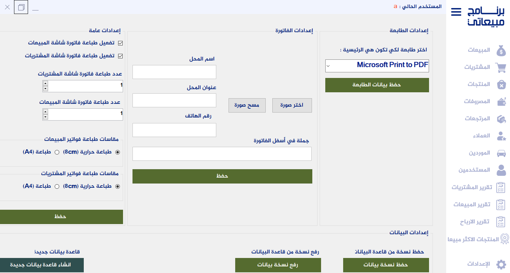

# Sales Managment System

## Table of Contents
- [Description](#description)
- [Features](#features)
- [How to Run](#how-to-run)
- [Requirements](#requirements)
- [Screenshots](#screenshots)

## Description
This is a simple C# WinForm desktop application for sales managment system mangement.

## Features
- CRUD operations.
- statistics of sales.
- create, import and export database. 
- printing bills and reports.

## How to Run
1. Open the solution file (SalesApp.sln) in Visual Studio.
2. Run the application.

## Requirements
- .NET Framework 4.72.
- SQL Server Express 2012.
- Krypton (NuGet Packages).
- SAP Crystal reports.

## Screenshots

