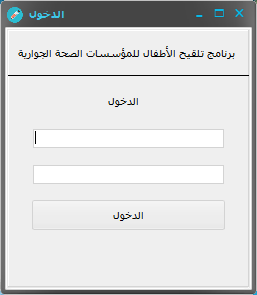
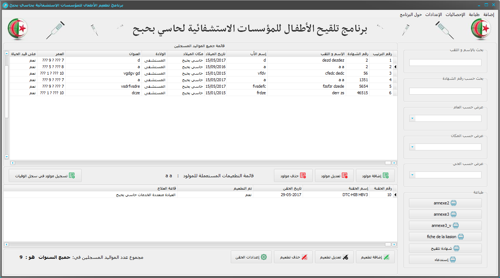
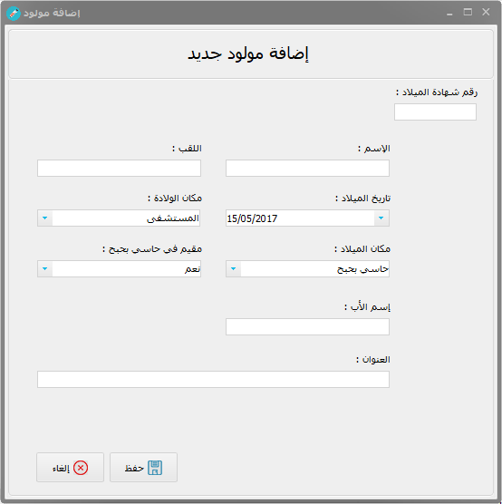
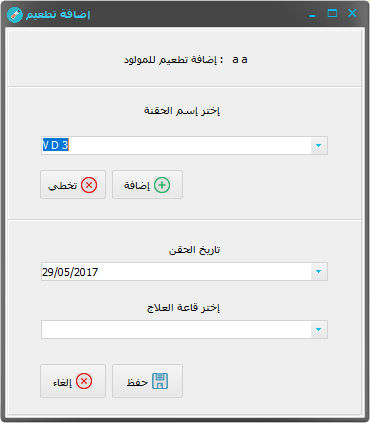
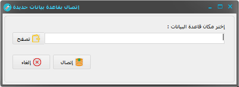
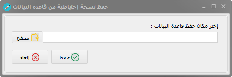
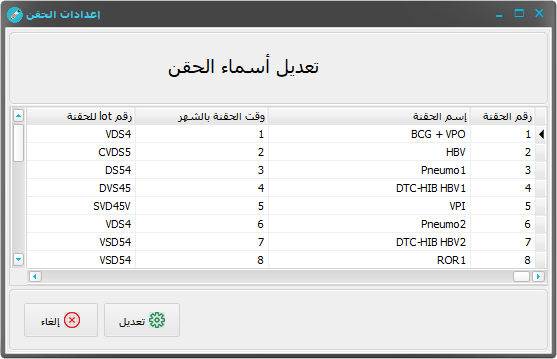

# Children vaccinations Management System

## Table of Contents
- [Description](#description)
- [Features](#features)
- [How to Run](#how-to-run)
- [Requirements](#requirements)
- [Screenshots](#screenshots)

## Description
This is a simple Delphi desktop application for Children vaccinations system mangement.

## Features
- CRUD operations.
- statistics support.
- create, import and export database. 
- print reports.

## How to Run
1. Open the project in delphi rad studio 10.
2. Run the application.

## Requirements
- delphi rad studio 10.
- MS ACCES.

## Screenshots  

### Login Screen  
  

### Main Screen  
  

### New Child Screen  
  

### New Vaccine Screen  
  

### New Database Screen  
  

### Save Database Screen  
  

### Injection List Screen  
  

